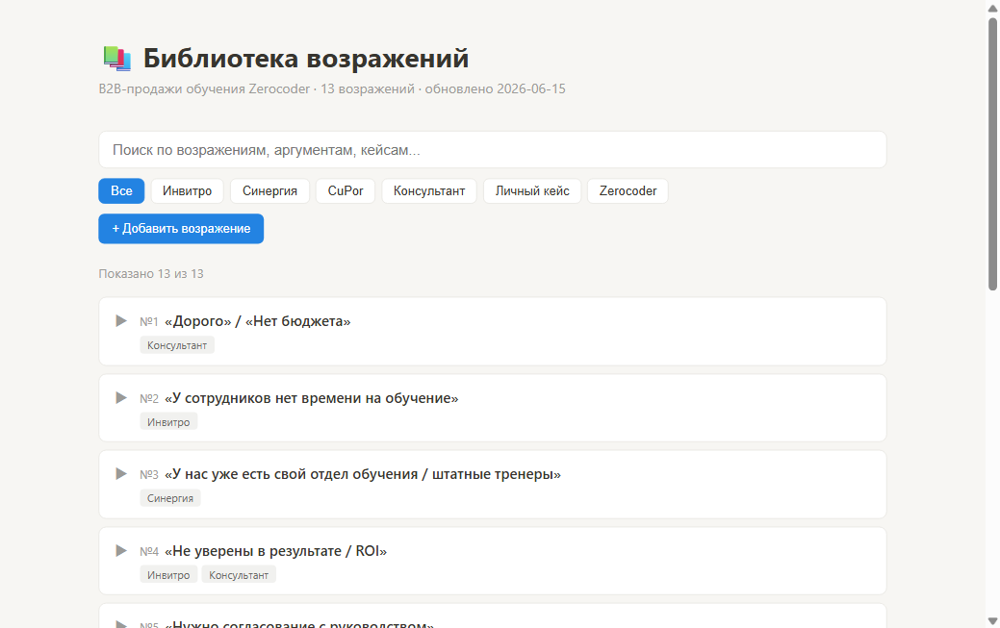
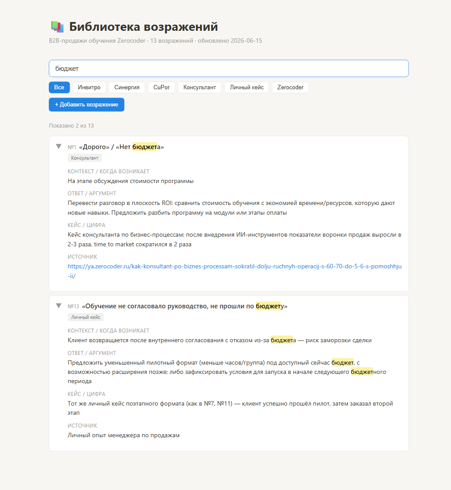
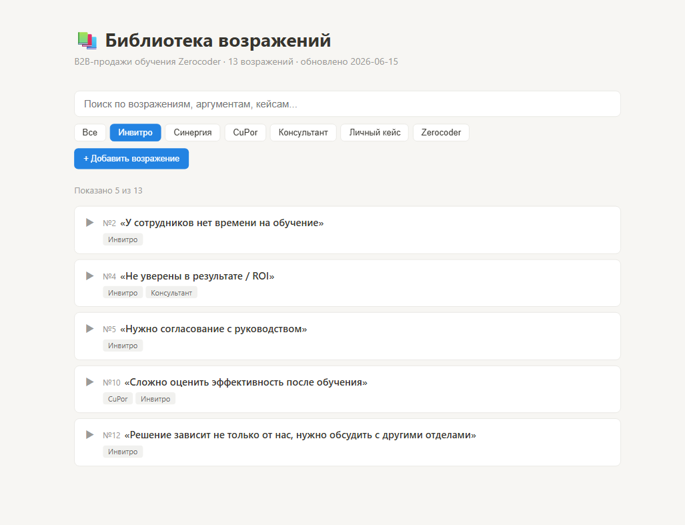
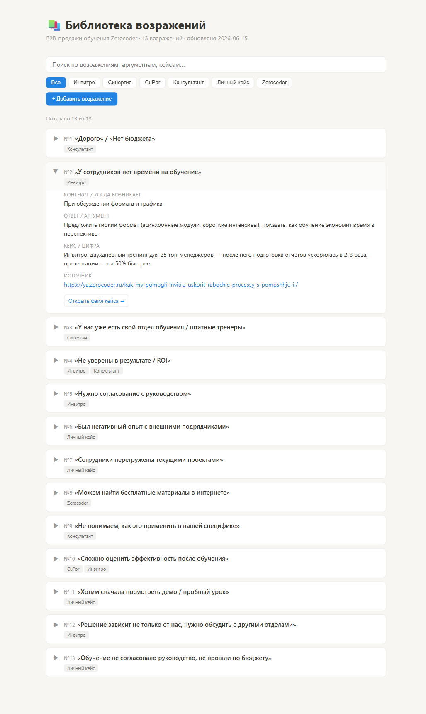
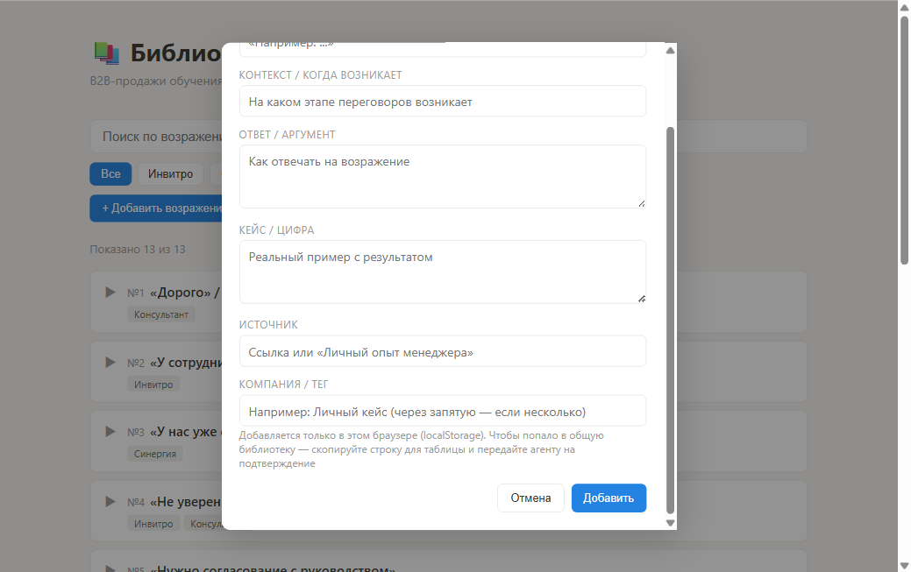

# 📚 Библиотека возражений и кейсов для B2B-продаж

Готовые ответы на типичные возражения клиентов в B2B-продажах, подкреплённые реальными кейсами и проверяемыми источниками — плюс веб-интерфейс для быстрого поиска и фильтрации.

## Какую проблему решает

На звонках и при подготовке коммерческих предложений менеджер по продажам сталкивается с одними и теми же возражениями («дорого», «нет времени», «у нас уже есть свой отдел обучения» и т.п.). Без готовой базы аргументов на поиск подходящего примера и цифры уходит **10-15 минут на каждое возражение** — либо аргумент озвучивается без подтверждения, что снижает убедительность.

## Решение

Единая таблица из 13 типичных возражений, где для каждого уже есть:
- готовый **ответ/аргумент**
- реальный **кейс с цифрами**
- проверяемый **источник** (ссылка или файл кейса)

Плюс — наглядный веб-интерфейс над этой таблицей и управляемый через Claude Code процесс пополнения новыми возражениями с подтверждением менеджера на каждом шаге.

## Эффект

| | До | После |
|---|---|---|
| Заполненность базы | 0/12 строк | 13/13 строк |
| Время на новое возражение | 10-15 мин вручную | ~1 мин с агентом |
| Источники | отсутствуют | ссылка у каждой строки |

---

## Как это выглядит

### Общий вид

Заголовок, строка поиска, фильтры по компаниям и список возражений в виде разворачиваемых карточек.



### Поиск с подсветкой

Ввод слова или фразы автоматически раскрывает подходящие карточки и подсвечивает совпадения.



### Фильтр по компании

Клик по названию компании оставляет только возражения с кейсами этой компании.



### Развёрнутая карточка

Контекст, ответ/аргумент, кейс с цифрой и ссылка на источник — со кнопкой перехода к файлу кейса, если он есть.



### Добавление возражения через форму

Кнопка «+ Добавить возражение» открывает форму — заполняется без редактирования markdown-таблицы напрямую.



### Черновик новой записи

Добавленная запись помечается «Добавлено вами», хранится в браузере и копируется как строка таблицы для передачи агенту на согласование.


---

## Быстрый старт

1. Открыть `sales-objections-library.md` в Obsidian — основная таблица
2. Или открыть `objections-library-viewer.html` в браузере (двойной клик, без установки) — веб-интерфейс с поиском и фильтрами
3. Подробная инструкция по использованию и обновлению — см. [USER-GUIDE.md](USER-GUIDE.md)

## Структура проекта

```
sales-objections-library.md          — основная таблица возражений (Obsidian)
objections-library-viewer.html       — веб-интерфейс
research-queue.md                    — очередь тем для ресёрча
cases/                                — развёрнутые кейс-файлы
templates/                           — шаблон новой записи
screenshots/                          — скриншоты интерфейса (для USER-GUIDE)
reports/                              — отчёты по проекту
```

## Технологии

Claude Code (агент и оркестрация), Obsidian (markdown-таблица как источник истины), статичная HTML/CSS/JS-страница (веб-интерфейс).

## Главное правило

Ресёрч новых кейсов и источников запускается **только по явному запросу** — без автоматики и расписания. Подробности — в [USER-GUIDE.md](USER-GUIDE.md).
